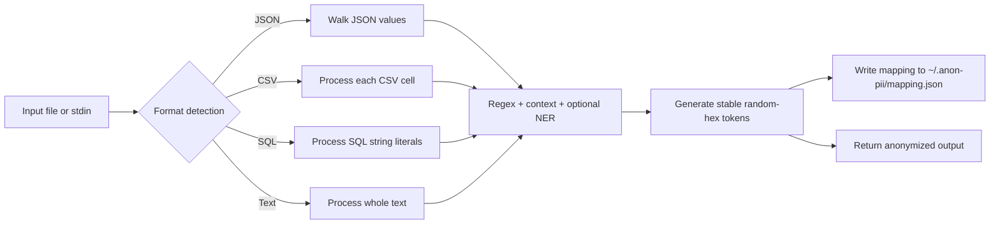
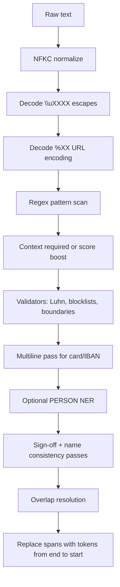
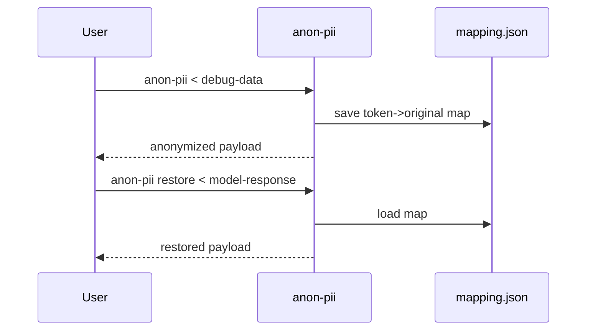

# anon-pii

[](https://github.com/tcheuD/anon-pii/actions/workflows/ci.yml)
[](https://opensource.org/licenses/MIT)

Fast CLI tool to anonymize PII in debug data before sharing with AI tools.

`anon-pii` is a local data-minimization aid. It helps detect, pseudonymize, redact,
or mask sensitive values before they leave your machine, but it is not a privacy
compliance guarantee and it cannot prove that a payload is fully anonymized.
Always evaluate it against your own data, policies, and risk tolerance before
production use.

## Security & Privacy Notice

- **Mapping files contain original PII.** The default token operator saves
  reversible token mappings to `~/.anon-pii/mapping.json` so `anon-pii restore` can put
  values back. Protect this file like the original data and never commit it.
- **False negatives are possible.** Pattern and NER-based detection can miss
  unusual identifiers, domain-specific formats, non-Latin text, split secrets,
  or ambiguous names.
- **False positives are possible.** Context-aware patterns and name detection can
  redact benign data, especially in logs with dense identifiers.
- **Local HTTP modes trust the local user session.** Proxy, UI, and REST API
  bind to loopback and validate Host headers, but they do not provide bearer-token
  authentication yet. Do not expose them through tunnels, containers, or port forwards.
- **High-risk workflows need review.** Medical, legal, financial, HR,
  education, and government data should use additional controls and human review.

## Installation

### From crates.io (once published)

```bash
# Default (regex-only, no NER)
cargo install anon-pii

# With heuristic name detection
cargo install anon-pii --features ner-lite

# With reverse proxy + web UI + REST API
cargo install anon-pii --features proxy

# With image redaction (requires Tesseract)
cargo install anon-pii --features image

# With PDF redaction
cargo install anon-pii --features pdf

# With XLSX format detection scaffold
cargo install anon-pii --features xlsx

# Recommended full build (heuristic NER + proxy, no ML deps)
cargo install anon-pii --features ner-lite,proxy
```

### From source

```bash
# Clone and install
git clone https://github.com/tcheuD/anon-pii.git
cd anon-pii

# Default (regex-only, no NER)
cargo install --path .

# With heuristic name detection (zero deps, +0 binary size)
cargo install --path . --features ner-lite

# With reverse proxy + web UI + REST API
cargo install --path . --features proxy

# Recommended full build (heuristic NER + proxy, no ML deps)
cargo install --path . --features ner-lite,proxy

# With ML name detection (requires ONNX Runtime)
brew install onnxruntime
export ORT_DYLIB_PATH=$(brew --prefix onnxruntime)/lib/libonnxruntime.dylib
cargo install --path . --features ner
anon-pii download-model  # one-time, cached at ~/.anon-pii/models/

# With image redaction (requires Tesseract)
brew install tesseract  # macOS
cargo install --path . --features image

# With PDF redaction
cargo install --path . --features pdf

# With XLSX format detection scaffold
cargo install --path . --features xlsx
```

To make `ORT_DYLIB_PATH` persist across terminal sessions, add it to your shell profile:

```bash
echo 'export ORT_DYLIB_PATH=$(brew --prefix onnxruntime)/lib/libonnxruntime.dylib' >> ~/.zshrc
```

This installs to `~/.cargo/bin/anon-pii`. If your PATH uses a different directory (e.g. `~/.local/bin`), create a symlink:

```bash
ln -sf ~/.cargo/bin/anon-pii ~/.local/bin/anon-pii
```

To update after code changes, re-run the same `cargo install` command.

## Feature Flags

| Feature | Enables | Extra requirements |
|---------|---------|--------------------|
| default | Regex, checksum, context, JSON, CSV, SQL, and text anonymization | None |
| `ner-lite` | Heuristic PERSON detection with `--ner` | None |
| `ner` | ML PERSON detection with ONNX Runtime, plus `ner-lite` fallback | ONNX Runtime and `ORT_DYLIB_PATH` |
| `proxy` | Reverse proxy, web UI, and Presidio-compatible REST API | None |
| `image` | OCR-backed image redaction | Tesseract and language data |
| `pdf` | Text-based PDF redaction | None beyond Rust dependencies |
| `xlsx` | XLSX format detection scaffold | Full workbook anonymization is not implemented yet |

## Quick Start

```bash
# Anonymize from stdin
echo 'Error for user john@example.com on F-GRHK' | anon-pii
# Output: Error for user [EMAIL_ADDRESS_a1b2c3d4] on [AIRCRAFT_REGISTRATION_b2c3d4e5]

# Anonymize JSON (auto-detected, structure preserved)
echo '{"email": "john@example.com", "count": 42}' | anon-pii
# Output: {"count": 42, "email": "[EMAIL_ADDRESS_c3d4e5f6]"}

# Redact instead of tokenize
echo 'User john@example.com logged in' | anon-pii --operator redact
# Output: User [REDACTED] logged in

# Mask with partial visibility
echo 'Card: 4111111111111111' | anon-pii --operator mask --mask-from-end
# Output: Card: ************1111

# Roundtrip: anonymize, share, restore
cat debug.json | anon-pii > safe.json
cat response.json | anon-pii restore

# Pipe through Claude
cat debug.json | anon-pii | claude -p "explain this error" | anon-pii restore

# Share-ready Markdown snippet (safe to paste into issues / AI tools)
cat debug.json | anon-pii --share --copy

# Redact PII in images (OCR + fill)
anon-pii image screenshot.png -o redacted.png
```

More runnable examples are in [demo/README.md](demo/README.md).

## Mapping Persistence

Default token mode persists a reversible mapping so `anon-pii restore` can put
original values back after an AI round trip. Use `--mapping` to choose a
different file. Bare tokens remain unchanged unless explicitly enabled; use
`--restore-bare` only for trusted legacy output that needs unbracketed token
restoration. Use `--mapping-stderr` for review pipelines, or
`--include-mapping` only when you intentionally want the sensitive map embedded
in supported output. Mapping files are written atomically with owner-only
permissions where the platform supports them. Proxy and UI modes keep mappings in memory by default;
pass `--persist-mapping` when you intentionally need server-side mappings on
disk for debugging or manual restore workflows.

Mapping is auto-saved to `~/.anon-pii/mapping.json` — no need to pass `-m` manually.

## How It Works

### 1) End-to-end anonymization path



### 2) Detection pipeline (inside `anonymize_text`)



### 3) Restore flow



## Usage

### Anonymize (default)

<!-- BEGIN CLI_ANONYMIZE -->
| Option | Short | Default | Description |
|--------|-------|---------|-------------|
| `--input` | `-i` |  | Input file (reads from stdin if not provided) |
| `--output` | `-o` |  | Output file (writes to stdout if not provided) |
| `--mapping` | `-m` |  | Save mapping to file for later restoration |
| `--mapping-stderr` |  |  | Output mapping to stderr |
| `--include-mapping` |  |  | Include mapping as comment in output |
| `--share` |  |  | Output a share-ready Markdown snippet (safe to paste into issues / AI tools) |
| `--copy` |  |  | Copy output to clipboard (best effort). Requires --share |
| `--verbose` | `-v` |  | Show detected entities |
| `--format` | `-f` | `auto` | Force input format |
| `--threshold` |  | `0.5` | Minimum confidence score (0.0-1.0) |
| `--operator` |  | `token` | Anonymization operator |
| `--mask-char` |  | `*` | Masking character (used with --operator mask) |
| `--mask-count` |  |  | Fixed mask length (default: match original length) |
| `--mask-from-end` |  |  | Mask from end instead of start |
| `--hash-algo` |  | `sha256` | Hash algorithm (used with --operator hash) |
| `--encrypt-key` |  |  | AES encryption key, hex-encoded (used with --operator encrypt) Must be 32 (128-bit), 48 (192-bit), or 64 (256-bit) hex characters |
| `--replace-with` |  |  | Custom replacement format string (used with --operator custom) Use {entity_type} as placeholder, e.g. '<{entity_type}>' or 'REDACTED' |
| `--context-boost` |  | `0.15` | Context score boost factor when keywords are found nearby (0.0-1.0) |
| `--min-score-with-context` |  | `0.0` | Minimum score for context-boosted detections (0.0 = disabled) |
| `--language` | `-l` | `en` | Language for detection |
| `--ner` |  |  | Enable NER-based PERSON detection (requires ner or ner-lite feature) |
| `--config` | `-c` |  | Path to YAML recognizer configuration file for custom patterns |
| `--batch-size` |  | `32` | Batch size for NER inference when processing text (default: 32) Set to 0 to disable batching. Only affects text format with --ner |
<!-- END CLI_ANONYMIZE -->

### Restore

<!-- BEGIN CLI_RESTORE -->
| Option | Short | Default | Description |
|--------|-------|---------|-------------|
| `INPUT_POSITIONAL` |  |  | Input file (positional, optional) |
| `--input` | `-i` |  | Input file (flag, optional — overrides positional) |
| `--mapping` | `-m` |  | Mapping file (defaults to ~/.anon-pii/mapping.json) |
| `--restore-bare` |  |  | Restore bare tokens in addition to bracketed tokens (compatibility mode; unsafe for untrusted model output) |
| `--output` | `-o` |  | Output file (writes to stdout if not provided) |
| `--decrypt-key` |  |  | AES decryption key, hex-encoded (decrypts ENC[...] tokens) Must be 32 (128-bit), 48 (192-bit), or 64 (256-bit) hex characters |
<!-- END CLI_RESTORE -->

### Commands

<!-- BEGIN COMMANDS -->
```bash
anon-pii restore [INPUT_POSITIONAL] # Restore original values from anonymized data
anon-pii list-entities                 # List all supported entity types
anon-pii api                 # Start Presidio-compatible REST API server (requires `proxy` feature)
anon-pii ui                 # Start web UI for interactive anonymization (requires `proxy` feature)
anon-pii update-names <FILE>          # Import first/last names from a CSV file into ~/.anon-pii/ for heuristic NER
anon-pii image <INPUT>         # Anonymize PII in images via OCR and redaction (requires `image` feature)
anon-pii pdf <INPUT>         # Anonymize PII in PDF documents via text extraction and redaction (requires `pdf` feature)
anon-pii proxy                 # Start anonymizing proxy server (requires `proxy` feature)
```
<!-- END COMMANDS -->

## Detected entities

<!-- BEGIN ENTITIES -->
63 entity types across 99 patterns covering 13 countries: emails, URLs, IPs, UUIDs, credit cards, IBANs, phones, dates, crypto addresses, MAC addresses, secrets/tokens, and person names (with `--ner`). Country-specific patterns include SSNs, passports, driver's licenses, tax IDs, and national IDs for AU, ES, FI, FR, IN, IT, KR, PL, SG, SI, TH, UK, US — each with checksum validation where applicable. Detection works through URL-encoded and Unicode-escaped text.

See [docs/entities.md](docs/entities.md) for the full reference with confidence scores and context keywords.
<!-- END ENTITIES -->

## Known Limitations

- `anon-pii` is optimized for developer/debug workflows, not legal de-identification
  or formal anonymization.
- Optional NER improves person detection but still depends on model coverage,
  dictionaries, local context, and post-processing heuristics.
- Image and PDF redaction rely on text extraction/OCR quality. Always visually
  inspect redacted documents before sharing.
- Proxy mode trusts local callers on the same machine. Do not expose it on a
  network interface.
- Custom recognizers can introduce catastrophic false positives or false
  negatives if regexes, scores, or context keywords are too broad.

## Documentation

| Guide | Description |
|-------|-------------|
| [Entity types](docs/entities.md) | All 63 entity types, scores, context-aware detection |
| [Proxy mode](docs/proxy.md) | Anonymizing reverse proxy for Anthropic, OpenAI, and generic LLM APIs |
| [REST API](docs/api.md) | Local Presidio-compatible HTTP API |
| [NER setup](docs/ner.md) | Person name detection — heuristic and ML backends |
| [REST API spec](docs/openapi.yaml) | OpenAPI 3.0 specification (Swagger) |
| [Threat model](docs/threat-model.md) | Security threat model and mitigations |
| [YouTrack integration](docs/youtrack.md) | `scripts/yt` — fetch issues with human review |
| [Image redaction](docs/image-redaction.md) | OCR-based image PII redaction |
| [PDF redaction](docs/pdf-redaction.md) | Text-based PDF PII redaction |
| [XLSX feature](docs/xlsx.md) | XLSX detection scaffold and current CSV workaround |
| [Release process](docs/release.md) | CI support matrix and first release checklist |

## Responsible Disclosure

Please report security issues privately where possible. See
[SECURITY.md](SECURITY.md) for reporting guidance and sensitive-data handling
rules.

## Development

### Setup

```bash
# Install git hooks (auto-updates README on commit)
./scripts/install-hooks.sh
```

### Updating README

The README is auto-updated by a pre-commit hook when `.rs` or `.toml` files change. To manually trigger:

```bash
# Update README from current code
cargo run --features ner-lite,proxy,image,pdf,xlsx --example update_readme

# Update benchmark numbers first, then README
cargo run --release --example benchmark  # writes bench-results.json
cargo run --features ner-lite,proxy,image,pdf,xlsx --example update_readme
```

### Tests

```bash
# Run tests (default — regex-only, no NER)
cargo test

# Check formatting and lints
cargo fmt --all --check
cargo clippy -- -D warnings
cargo clippy --features ner-lite,proxy -- -D warnings

# Run tests including NER heuristic + proxy tests (matches CI)
cargo test --features ner-lite,proxy

# Run tests including NER heuristic tests only
cargo test --features ner-lite

# Run tests including image tests (requires Tesseract)
cargo test --features image
cargo test --features image -- --ignored  # end-to-end OCR tests

# Run PDF redaction tests
cargo test --features pdf

# Run XLSX detection scaffold tests
cargo test --features xlsx

# Build release binary
cargo build --release

# Build release with NER
cargo build --release --features ner-lite
cargo build --release --features ner
```

`cargo test` without feature flags runs all tests except NER-specific and proxy-specific ones. This is the standard check after any change.

### Benchmark

```bash
cargo run --release --example benchmark
cargo run --release --features ner-lite --example benchmark
cargo run --release --features ner --example benchmark
```

Typical results (Apple Silicon):

<!-- BEGIN BENCHMARK -->
| Feature | Throughput | Simple avg | Complex avg | Penalty |
|---------|------------|------------|-------------|---------|
| regex-only | 59k lines/s | 12.6 μs | 33.1 μs | 2.6x |
| ner-lite (heuristic) | 52k lines/s | 14.5 μs | 37.3 μs | 2.6x |
<!-- END BENCHMARK -->

## License

MIT
