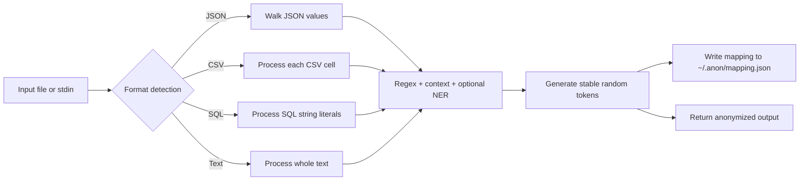
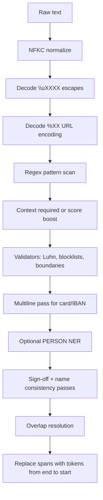
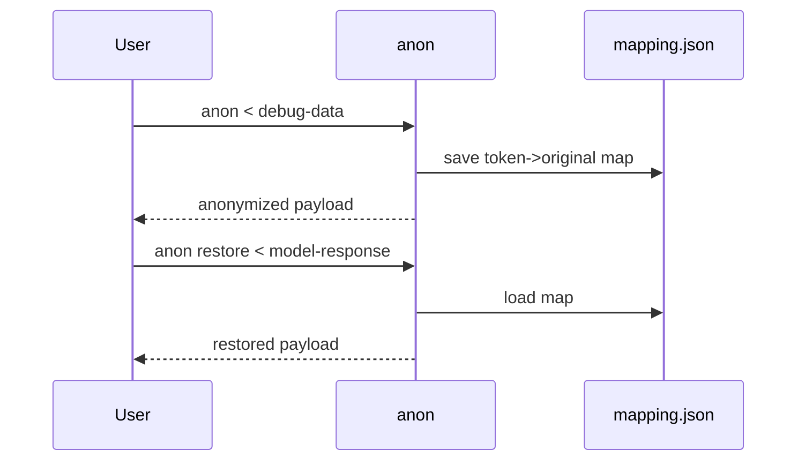

# anon

Fast CLI tool to anonymize PII in debug data before sharing with AI tools.

## Installation

```bash
# Default (regex-only, no NER)
cargo install --path .

# With heuristic name detection (zero deps, +0 binary size)
cargo install --path . --features ner-lite

# With reverse proxy + web UI + REST API
cargo install --path . --features proxy

# Recommended full build (heuristic NER + proxy, no ML deps)
cargo install --path . --features ner-lite,proxy

# With ML name detection (requires ONNX Runtime)
brew install onnxruntime
export ORT_DYLIB_PATH=$(brew --prefix onnxruntime)/lib/libonnxruntime.dylib
cargo install --path . --features ner
anon download-model  # one-time, cached at ~/.anon/models/

# With image redaction (requires Tesseract)
brew install tesseract  # macOS
cargo install --path . --features image
```

To make `ORT_DYLIB_PATH` persist across terminal sessions, add it to your shell profile:

```bash
echo 'export ORT_DYLIB_PATH=$(brew --prefix onnxruntime)/lib/libonnxruntime.dylib' >> ~/.zshrc
```

This installs to `~/.cargo/bin/anon`. If your PATH uses a different directory (e.g. `~/.local/bin`), create a symlink:

```bash
ln -sf ~/.cargo/bin/anon ~/.local/bin/anon
```

To update after code changes, re-run the same `cargo install` command.

## Quick Start

```bash
# Anonymize from stdin
echo 'Error for user john@example.com on F-GRHK' | anon
# Output: Error for user [EMAIL_ADDRESS_1] on [AIRCRAFT_REGISTRATION_1]

# Anonymize JSON (auto-detected, structure preserved)
echo '{"email": "john@example.com", "count": 42}' | anon
# Output: {"count": 42, "email": "[EMAIL_ADDRESS_1]"}

# Redact instead of tokenize
echo 'User john@example.com logged in' | anon --operator redact
# Output: User [REDACTED] logged in

# Mask with partial visibility
echo 'Card: 4111111111111111' | anon --operator mask --mask-from-end
# Output: Card: ************1111

# Roundtrip: anonymize, share, restore
cat debug.json | anon > safe.json
cat response.json | anon restore

# Pipe through Claude
cat debug.json | anon | claude -p "explain this error" | anon restore

# Share-ready Markdown snippet (safe to paste into issues / AI tools)
cat debug.json | anon --share --copy

# Redact PII in images (OCR + fill)
anon image screenshot.png -o redacted.png
```

Mapping is auto-saved to `~/.anon/mapping.json` — no need to pass `-m` manually.

## How It Works

### 1) End-to-end anonymization path



### 2) Detection pipeline (inside `anonymize_text`)



### 3) Restore flow



## Usage

### Anonymize (default)

| Option | Short | Default | Description |
|--------|-------|---------|-------------|
| `--input` | `-i` | stdin | Input file |
| `--output` | `-o` | stdout | Output file |
| `--mapping` | `-m` | `~/.anon/mapping.json` | Save mapping to file for later restoration |
| `--mapping-stderr` | | | Output mapping to stderr |
| `--include-mapping` | | | Embed mapping as `/* MAPPING: ... */` comment in output |
| `--verbose` | `-v` | | Show detected entities table on stderr |
| `--format` | `-f` | `auto` | Force input format: `auto`, `json`, `text`, `sql`, `csv` |
| `--threshold` | | `0.5` | Minimum confidence score (0.0-1.0) |
| `--operator` | | `token` | Anonymization operator: `token`, `redact`, `mask`, `hash`, `encrypt`, `keep`, `custom` |
| `--mask-char` | | `*` | Masking character (used with `--operator mask`) |
| `--mask-count` | | match length | Fixed mask length (used with `--operator mask`) |
| `--mask-from-end` | | | Mask from end instead of start |
| `--hash-algo` | | `sha256` | Hash algorithm: `sha256`, `md5` (used with `--operator hash`) |
| `--encrypt-key` | | | AES key, hex-encoded: 32/48/64 chars (used with `--operator encrypt`) |
| `--replace-with` | | | Custom replacement format, e.g. `<{entity_type}>` (used with `--operator custom`) |
| `--context-boost` | | `0.15` | Context keyword score boost factor (0.0-1.0) |
| `--min-score-with-context` | | `0.0` | Minimum score for context-boosted detections |
| `--language` | `-l` | `en` | Language for detection |
| `--share` | | | Output a share-ready Markdown snippet |
| `--copy` | | | Copy output to clipboard (requires `--share`) |
| `--ner` | | | Enable NER-based PERSON detection (requires `ner` or `ner-lite` feature) |

### Restore

| Option | Short | Default | Description |
|--------|-------|---------|-------------|
| `INPUT` | | | Positional input file |
| `--input` | `-i` | | Input file flag (overrides positional) |
| `--mapping` | `-m` | `~/.anon/mapping.json` | Mapping file for restoration |
| `--output` | `-o` | | Output file (stdout if omitted) |
| `--decrypt-key` | | | AES decryption key, hex-encoded (decrypts `ENC[...]` tokens) |

### Commands

```bash
anon list-entities        # List all supported entity types
anon update-names <CSV>   # Import custom name lists from CSV for heuristic NER
anon download-model       # Download NER ML model (requires `ner` feature)
anon api                  # Presidio-compatible REST API on :8080, Swagger at /docs (requires `proxy` feature)
anon ui                   # Interactive web UI on :9200 (requires `proxy` feature)
anon proxy                # Anonymizing reverse proxy on :9100 (requires `proxy` feature)
anon image <path> -o <out>  # OCR-based image PII redaction (requires `image` feature)
```

## Detected entities

63 entity types across 97 patterns covering 13 countries: emails, URLs, IPs, UUIDs, credit cards, IBANs, phones, dates, crypto addresses, MAC addresses, secrets/tokens, and person names (with `--ner`). Country-specific patterns include SSNs, passports, driver's licenses, tax IDs, and national IDs for US, UK, FR, ES, IT, IN, AU, KR, SG, PL, SI, FI, and TH — each with checksum validation where applicable. Detection works through URL-encoded and Unicode-escaped text.

See [docs/entities.md](docs/entities.md) for the full reference with confidence scores and context keywords.

## Documentation

| Guide | Description |
|-------|-------------|
| [Entity types](docs/entities.md) | All 63 entity types, scores, context-aware detection |
| [Proxy mode](docs/proxy.md) | Anonymizing reverse proxy for the Anthropic API |
| [NER setup](docs/ner.md) | Person name detection — heuristic and ML backends |
| [REST API spec](docs/openapi.yaml) | OpenAPI 3.0 specification (Swagger) |
| [Threat model](docs/threat-model.md) | Security threat model and mitigations |
| [YouTrack integration](docs/youtrack.md) | `scripts/yt` — fetch issues with human review |
| [Image redaction](docs/image-redaction.md) | OCR-based image PII redaction |

## Development

```bash
# Run tests (default — regex-only, no NER)
cargo test

# Run tests including NER heuristic + proxy tests (matches CI)
cargo test --features ner-lite,proxy

# Run tests including NER heuristic tests only
cargo test --features ner-lite

# Run tests including image tests (requires Tesseract)
cargo test --features image
cargo test --features image -- --ignored  # end-to-end OCR tests

# Build release binary
cargo build --release

# Build release with NER
cargo build --release --features ner-lite
cargo build --release --features ner
```

`cargo test` without feature flags runs all tests except NER-specific and proxy-specific ones. This is the standard check after any change.

### Benchmark

```bash
cargo run --release --example benchmark
cargo run --release --features ner-lite --example benchmark
cargo run --release --features ner --example benchmark
```

Typical results (Apple Silicon):

| Feature | Throughput | Simple avg | Complex avg | Penalty |
|---------|-----------|-----------|-------------|---------|
| none | 251k lines/s | 2.8 μs | 8.9 μs | 3.2x |
| ner-lite | 184k lines/s | 3.9 μs | 11.4 μs | 2.9x |
| ner | 247k lines/s | 2.8 μs | 8.9 μs | 3.1x |

## License

MIT
