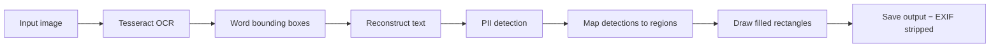

# Image Redaction

[Back to README](../README.md)

Anonymize PII in images via OCR and pixel-domain redaction. Extracts text with
Tesseract, runs the full detection pipeline, then draws filled rectangles over
PII regions.

## Pipeline



## Prerequisites

```bash
# macOS
brew install tesseract

# Ubuntu/Debian
sudo apt-get install tesseract-ocr libtesseract-dev libleptonica-dev

# Build with image feature
cargo install --path . --features image
```

## Usage

```bash
# Basic redaction
anon image photo.png -o redacted.png

# Custom fill color and threshold
anon image screenshot.png -o safe.png --fill-color red --threshold 0.8

# Extra padding around detections
anon image scan.jpg -o clean.jpg --padding 5

# Hex color
anon image doc.png -o out.png --fill-color '#FF0000'
```

## Options

| Option | Default | Description |
|--------|---------|-------------|
| `<PATH>` | required | Input image file (PNG, JPEG) |
| `--output`, `-o` | required | Output image path |
| `--threshold` | `0.5` | Minimum detection confidence (0.0–1.0) |
| `--fill-color` | `black` | Fill color: named or `#RRGGBB`/`#RGB` hex |
| `--padding` | `2` | Extra pixels around each detected region |

## Supported formats

| Format | Input | Output |
|--------|-------|--------|
| PNG | Yes | Yes |
| JPEG | Yes | Yes |
| TIFF | Yes (via Tesseract) | No |

## Limitations

- OCR quality depends on image resolution and Tesseract language data
- Only English (`eng`) language data used by default
- Handwritten text detection is unreliable
- Very small text (< ~10px height) may not be detected
- EXIF/metadata is stripped from output (intentional for privacy)
