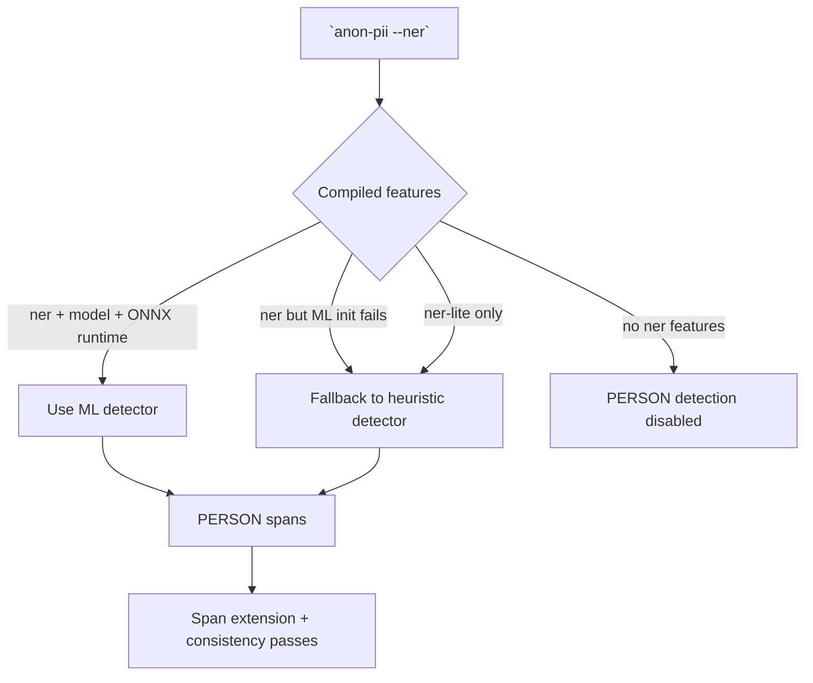
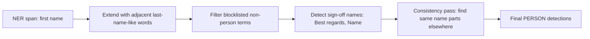

# NER — Person Name Detection

[Back to README](../README.md)

Person names aren't reliably detectable with regex. The `--ner` flag enables NER-based detection with two backends, selected at compile time via feature flags.

## Backend selection flow



## Heuristic (`ner-lite`)

Zero dependencies. Detects names using title patterns (M., Mme, Dr, Captain...) and a ~500 entry French/English first name dictionary.

```bash
cargo install --path . --features ner-lite

echo "M. Dupont est pilote, Dr Martin en copilote" | anon-pii --ner
# M. [PERSON_a1b2c3d4] est pilote, Dr [PERSON_b2c3d4e5] en copilote
```

## ML (`ner`)

Uses DistilBERT multilingual NER (Davlan/distilbert-base-multilingual-cased-ner-hrl) via ONNX Runtime. INT8 quantized, ~130MB model.

```bash
# 1. Install ONNX Runtime
brew install onnxruntime  # macOS
# apt install libonnxruntime-dev  # Debian/Ubuntu
export ORT_DYLIB_PATH=$(brew --prefix onnxruntime)/lib/libonnxruntime.dylib

# 2. Install with ner feature
cargo install --path . --features ner

# 3. Download model (~130MB, cached at ~/.anon-pii/models/)
anon-pii download-model

# 4. Use
echo "Jean Dupont called from Paris" | anon-pii --ner
# [PERSON_c3d4e5f6] called from Paris
```

The ML backend detects names in French, English, German, Spanish, Portuguese, Dutch, Arabic, and Chinese without any keyword context.

When both features are compiled (`--features ner,ner-lite`), ML takes precedence.

## PERSON post-processing


