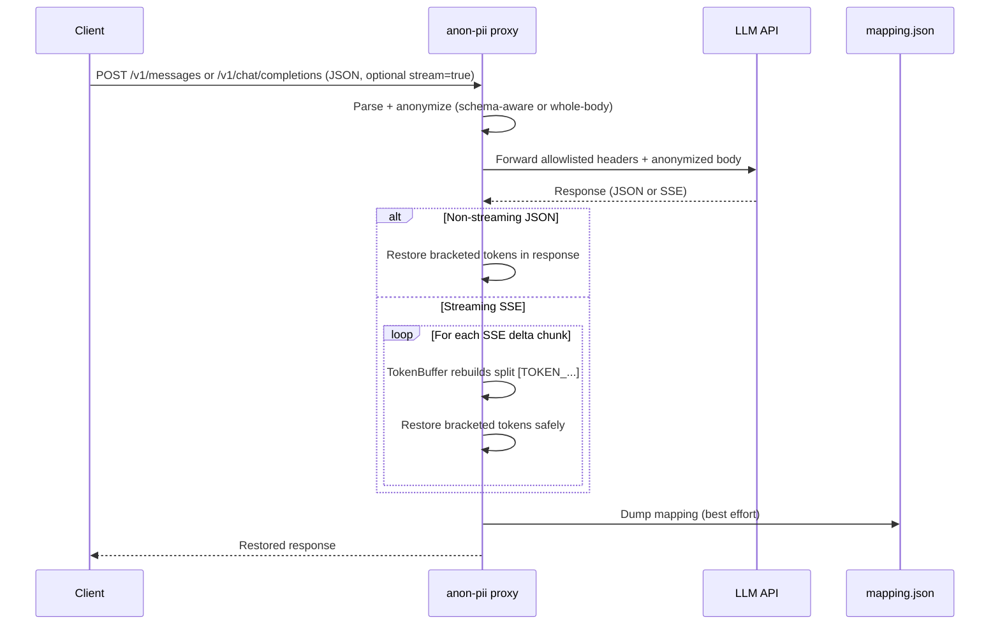
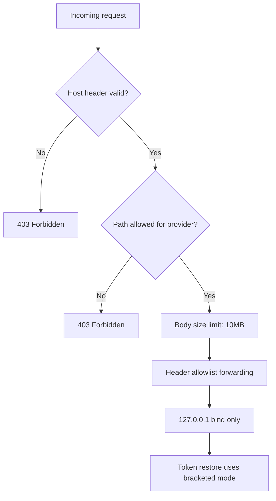

# Proxy Mode

[Back to README](../README.md)

Anonymizing reverse proxy that sits between AI coding tools and LLM APIs. PII is stripped from outgoing prompts and restored in incoming responses — including SSE streams. Supports Anthropic, OpenAI, and generic LLM providers.

## Supported Providers

| Provider | Endpoint | Description |
|----------|----------|-------------|
| `anthropic` (default) | `/v1/messages` | Anthropic Claude API - schema-aware anonymization |
| `openai` | `/v1/chat/completions` | OpenAI Chat Completions API - schema-aware anonymization |
| `generic` | Both endpoints | Any LLM API - whole-body JSON anonymization |

### Provider-specific behavior

- **Anthropic**: Anonymizes `system`, `messages[].content`, `tool_result.content`, `tool_use.input`. Only forwards Anthropic headers (`x-api-key`, `anthropic-version`, `anthropic-beta`).
- **OpenAI**: Anonymizes `messages[].content`, `tool_calls[].function.arguments`, `tools[].function.parameters.*.description`. Only forwards OpenAI headers (`openai-organization`, `openai-project`).
- **Generic**: Anonymizes all string values in the entire JSON body recursively. Forwards only base headers (`authorization`, `content-type`, `accept`, `user-agent`) by default. Provider-specific headers (`x-api-key`, `anthropic-version`, `anthropic-beta`, `openai-organization`, `openai-project`) require `--generic-forward-provider-headers`. Use this for local LLMs (Ollama, vLLM) or unsupported providers. Built-in `/v1/messages` and `/v1/chat/completions` routes are enabled by default; other fallback paths require `--generic-allow-path-prefix`.

## Request / response flow



The final dump step only runs when `--persist-mapping` is enabled; otherwise the
mapping remains in process memory.

## Safety controls



## Start the proxy

```bash
# Anthropic (default)
anon-pii proxy
# anon-pii proxy listening on http://127.0.0.1:9100
# upstream: https://api.anthropic.com

# OpenAI
anon-pii proxy --provider openai --upstream https://api.openai.com
# anon-pii proxy listening on http://127.0.0.1:9100
# upstream: https://api.openai.com

# Generic (OpenAI-compatible routes)
anon-pii proxy --provider generic --upstream http://localhost:11434
# anon-pii proxy listening on http://127.0.0.1:9100
# upstream: http://localhost:11434

# Generic fallback routes require an explicit allowlist
anon-pii proxy --provider generic --upstream http://localhost:11434 \
  --generic-allow-path-prefix /api/

# Generic upstreams that deliberately require Anthropic/OpenAI headers
anon-pii proxy --provider generic --upstream https://llm.example.com \
  --generic-forward-provider-headers
```

## Use with AI coding tools

```bash
# Claude Code (Anthropic)
ANTHROPIC_BASE_URL=http://127.0.0.1:9100 claude

# OpenAI-compatible tools
OPENAI_API_BASE=http://127.0.0.1:9100 your-tool

# For tools that need https, use a local TLS terminator like caddy or mkcert
```

All prompts are anonymized before reaching the API. Responses have tokens restored automatically.

By default, proxy mappings are kept in memory and discarded when the process exits.
Use `--persist-mapping` only when you need an on-disk session mapping for debugging
or manual restore workflows.

## Options

| Option | Short | Default | Description |
|--------|-------|---------|-------------|
| `--port` | `-p` | `9100` | Port to listen on |
| `--upstream` | `-u` | `https://api.anthropic.com` | Upstream API URL |
| `--threshold` | | `0.5` | Minimum confidence score (0.0-1.0) |
| `--session-dir` | | `/tmp/anon-proxy-<random>` | Directory for mapping files when persistence is enabled |
| `--persist-mapping` | | `false` | Write reversible session mappings to disk |
| `--provider` | | `anthropic` | API provider: `anthropic`, `openai`, or `generic` |
| `--generic-allow-path-prefix` | | none | Allow a generic-provider fallback path prefix; repeat for multiple prefixes |
| `--unsafe-generic-allow-all-paths` | | `false` | Allow generic-provider fallback forwarding for any path after traversal checks |
| `--generic-forward-provider-headers` | | `false` | Forward Anthropic/OpenAI provider-specific headers in generic mode |

## Testing without an API key

Point the proxy at a local echo server to inspect what gets sent upstream:

```bash
# Terminal 1 — echo server
python3 -c "
import http.server, json
class H(http.server.BaseHTTPRequestHandler):
    def do_POST(self):
        body = self.rfile.read(int(self.headers['Content-Length']))
        print(json.dumps(json.loads(body), indent=2))
        self.send_response(200)
        self.send_header('content-type','application/json')
        self.end_headers()
        self.wfile.write(json.dumps({'content':[{'type':'text','text':'ok'}]}).encode())
http.server.HTTPServer(('127.0.0.1',8888),H).serve_forever()
"

# Terminal 2 — proxy pointing at echo server
anon-pii proxy --upstream http://127.0.0.1:8888

# Terminal 3 — send a request
curl -s http://127.0.0.1:9100/v1/messages \
  -H "content-type: application/json" \
  -d '{"messages":[{"role":"user","content":"Email me at john@secret.com"}]}' | jq .
```

The echo server prints the anonymized body — `[EMAIL_ADDRESS_a1b2c3d4]` instead of `john@secret.com`.

## Monitoring

This section applies only when `--persist-mapping` is enabled.

The mapping file is written after each request and on shutdown. The session directory path is printed at startup:

```bash
# Watch the mapping grow (use the path printed by the proxy)
watch -n1 'jq . /tmp/anon-proxy-*/mapping.json 2>/dev/null'

# Or use a fixed session dir
anon-pii proxy --session-dir /tmp/my-session
watch -n1 'jq . /tmp/my-session/mapping.json'
```

## Test with curl

### Anthropic API

```bash
# Non-streaming
curl -s http://127.0.0.1:9100/v1/messages \
  -H "x-api-key: $ANTHROPIC_API_KEY" \
  -H "anthropic-version: 2023-06-01" \
  -H "content-type: application/json" \
  -d '{
    "model": "claude-sonnet-4-20250514",
    "max_tokens": 256,
    "messages": [
      {"role": "user", "content": "Summarize: John lives at john@example.com, IP 192.168.1.42"}
    ]
  }' | jq .

# Streaming
curl -s --no-buffer http://127.0.0.1:9100/v1/messages \
  -H "x-api-key: $ANTHROPIC_API_KEY" \
  -H "anthropic-version: 2023-06-01" \
  -H "content-type: application/json" \
  -d '{
    "model": "claude-sonnet-4-20250514",
    "max_tokens": 256,
    "stream": true,
    "messages": [
      {"role": "user", "content": "What about pilot JDU on aircraft F-HOPA?"}
    ]
  }'
```

### OpenAI API

```bash
# Start proxy with OpenAI provider
anon-pii proxy --provider openai --upstream https://api.openai.com

# Non-streaming
curl -s http://127.0.0.1:9100/v1/chat/completions \
  -H "Authorization: Bearer $OPENAI_API_KEY" \
  -H "content-type: application/json" \
  -d '{
    "model": "gpt-4",
    "messages": [
      {"role": "user", "content": "Contact me at john@example.com"}
    ]
  }' | jq .

# Streaming
curl -s --no-buffer http://127.0.0.1:9100/v1/chat/completions \
  -H "Authorization: Bearer $OPENAI_API_KEY" \
  -H "content-type: application/json" \
  -d '{
    "model": "gpt-4",
    "stream": true,
    "messages": [
      {"role": "user", "content": "My server is at 192.168.1.100"}
    ]
  }'
```

### Generic (Ollama example)

```bash
# Start proxy with generic provider pointing to Ollama.
# OpenAI-compatible /v1/chat/completions works without fallback allowlists.
anon-pii proxy --provider generic --upstream http://localhost:11434

curl -s http://127.0.0.1:9100/v1/chat/completions \
  -H "content-type: application/json" \
  -d '{
    "model": "llama3.2",
    "messages": [
      {"role": "user", "content": "Email admin@secret.com for help"}
    ]
  }' | jq .
```

Ollama-native fallback paths such as `/api/generate` are rejected by default.
Enable only the prefixes you intend to expose:

```bash
anon-pii proxy --provider generic --upstream http://localhost:11434 \
  --generic-allow-path-prefix /api/

curl -s http://127.0.0.1:9100/api/generate \
  -H "content-type: application/json" \
  -d '{"model":"llama3.2","prompt":"Email admin@secret.com for help"}' | jq .
```

## Security notes

- Binds to `127.0.0.1` only — not accessible from the network
- Host header validation blocks DNS rebinding attacks
- Mapping persistence is off by default; if enabled, the mapping file contains original PII and must be treated as sensitive
- There is no local bearer-token auth yet. Use only on a trusted single-user workstation and do not expose the listener through tunnels, containers, or port forwards.
- Provider API credentials are forwarded only when permitted by the provider header allowlist, and are never logged or stored
- Generic mode blocks cross-provider headers by default; only `authorization`, `content-type`, `accept`, and `user-agent` are forwarded unless `--generic-forward-provider-headers` is set.
- Generic fallback paths are denied by default; broad forwarding requires either explicit prefixes or `--unsafe-generic-allow-all-paths`.
- Pattern and NER detection can miss unusual, domain-specific, split, or ambiguous identifiers; review high-risk payloads before relying on proxy output.
